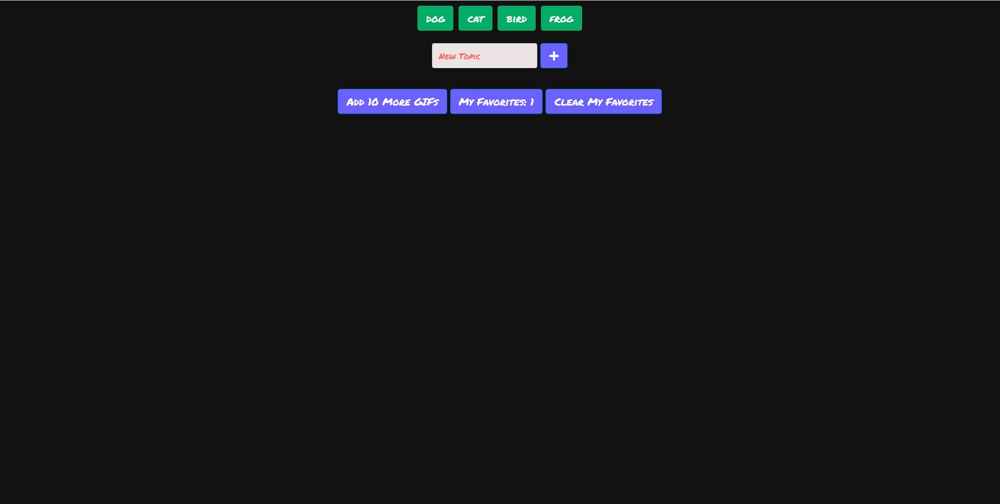
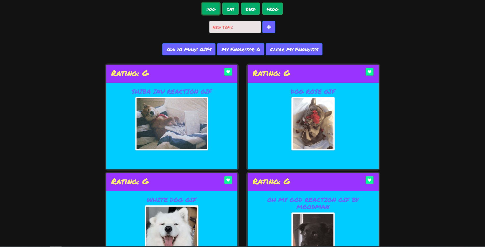
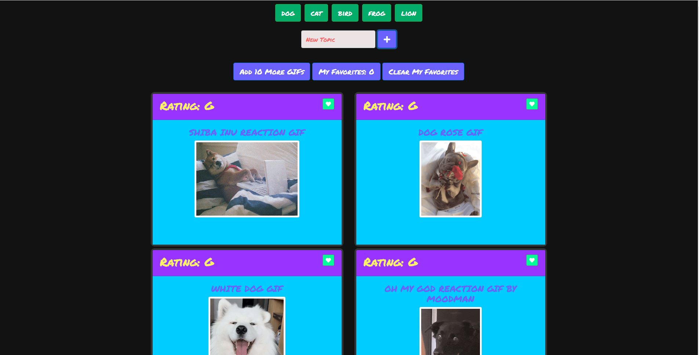

# GifTastic

1. the page starts with 4 tpics already displayed.
   

2. When the user clicks on one of the buttons, it will display 10 GIF related to the topic on the button
   

3. when the user clicks on the GIF it will pause when click back it will animate.
4. if the user click on 'add 10 more' buttons while GIFs displayed on the page it will display 10 more GIFs related to the same topic of the GIFs already displayed. It will check if there's GIFs already displayed before adding 10 more otherwise the user will get an alert "no GIF to display"

5. the user can type any topic in the text field and press the plus buttons to add new topic button. User cannot add button for empty text also cannot add button for not valid topic (ex: sagsdgdsgd).
   

6. The user can click on the heart button on each GIF to add it to my favorites
7. my favorite will be stored on the local storage of the browers and it will be saved even if the tap was closed. Everytime the user click on the heart button the counter on my favorites buttons will increas and the user cannot add duplicates to my favorite.

8. the user can clear my favorites by clicking on clear my favorites buttons.
